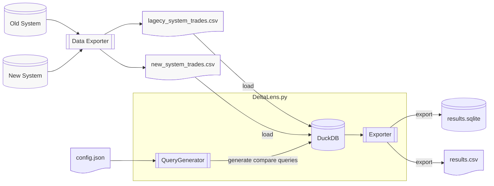

```ascii
 ____       _ _        _                    
|  _ \  ___| | |_ __ _| |    ___ _ __  ___ 
| | | |/ _ \ | __/ _` | |   / _ \ '_ \/ __|
| |_| |  __/ | || (_| | |__|  __/ | | \__ \
|____/ \___|_|\__\__,_|_____\___|_| |_|___/
                                        
```

# DeltaLens - Data Comparison Tool

DeltaLens is a powerful tool for comparing large datasets using the power of [DuckDB](https://duckdb.org/) as the comparison engine. It supports data transformations, automated field-level matching, and detailed comparison reporting.



## Features

- Compare CSV datasets with configurable primary keys
- Apply SQL transformations to data before comparison
- Generate detailed field-level match statistics
- Export results to SQLite and CSV for analysis
- Support for larger than memory datasets
- Support for reference datasets
- Docker support for containerized execution
- CLI and Python API interfaces
- Data Pipeline and CI/CD friendly

## Installation

Install from PyPI:
```bash
pip install delta-lens
```
see data_compare_legislators.ipynb for example.


## Basic Usage

### Command Line Interface

```bash
# Basic comparison
deltalens --config data/compare.config.json --run-name daily_compare

# Full options
deltalens \
  --config data/compare.config.json \
  --run-name daily_compare \
  --output-dir ./results \
  --persistent \
  --continue-on-error \
  --export-sqlite \
  --export-csv \
  --export-sampling-threshold 5000 \
  --export-mismatches-only \
  --log-level DEBUG
```


Or Pull the Docker image:

```bash

docker run unclepaul84/deltalens:latest
```


## Using DeltaLens in Jupyter Notebooks

DeltaLens can be used interactively in Jupyter notebooks for data comparison analysis. See data_compare_legislators.ipynb


## Configuration

Create a compare.config.json file:

```json
{  
    "defaults":{},
    "entities": [
        {
            "entityName":"trade",
            "leftSide": {
                "title": "legacy",
                "inputFile":"data/legacy_system_trades.csv"
                
                

            },
            "rightSide": {
                "title": "new",
                "inputFile":"data/new_system_trades.csv"
            },
            "primaryKeys": ["trade_id"]
        
        }     
    ]
}

```


## Environment Variables

| Variable | Description | Default |
|----------|-------------|---------|
| `DELTALENS_CONFIG` | Path to config file | compare.config.json |
| `DELTALENS_RUN_NAME` | Name for comparison run | `compare_YYYY-MM-DD` |
| `DELTALENS_OUTPUT_DIR` | Output directory | `.` |
| `DELTALENS_PERSISTENT` | Use persistent storage | `false` |
| `DELTALENS_EXPORT_SQLITE` | Export to SQLite | `true` |
| `DELTALENS_EXPORT_SAMPLING_THRESHOLD` | rowcount at which to start sampling | `10000` |
| `DELTALENS_EXPORT_CSV` | export to gzipped csv | `true` |
| `DELTALENS_EXPORT_MISMATCHES_ONLY` | Export mismatched rows only | `true` |

## Output Files

The tool generates several output files:
- `[run_name].duckdb`: DuckDB database with comparison results (if persistent mode enabled)
- `[run_name].sqlite`: SQLite export of comparison results (if enabled)

Resulting Tables include:
- `entity_compare_results`: Overall comparison summary
- `[entity]_compare`: Detailed record-level comparison
- `[entity]_compare_field_summary`: Field-level match statistics

## Development

### Docker

```bash
# Run with docker-compose
docker-compose up

# Run with custom arguments
docker-compose run deltalens --run-name custom_run --log-level DEBUG
```

### Generating Sample Data

DeltaLens includes a script to generate sample trade data for testing and demonstration purposes.

#### Sample Data Generator

The script creates two CSV files with randomized trade data:
- `legacy_system_trades.csv`: Original trade data with modifications
- `new_system_trades.csv`: Copy of original data with known differences

```bash
cd data
# Generate sample data (creates 2GB files by default)
python create_test_datasets.py
```
```bash
# Install development dependencies
pip install -r requirements.txt
pip install -r requirements-dev.txt

# Run tests
pytest -v

# Run tests with coverage
pytest --cov=delta_lens -v
```

## License

MIT License

## Contributing

1. Fork the repository
2. Create a feature branch
3. Submit a pull request

